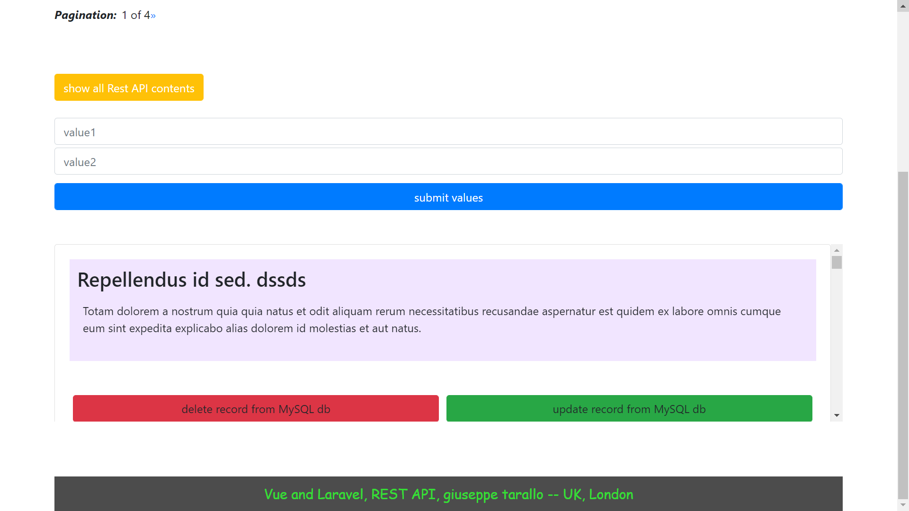

# Project Description


## *Preview image of the project*




Laravel and Vue  REST API 
--------------------------------

**Purpose of the application:** The project gives the possibility to insert the data in a MySQL db and to show them via a SPA created through the Vue framework, the control of the data takes place by the Laravel framework, using the JSON:API specifications.

***Description:*** The purpose of the project is to use a SPA Vue that makes requests through the HTML methods: PUT, GET, POST and DELETE, using the native function of Vue fetch (promise), the requests are intercepted by the Laravel controller that controls the logic and modifies the MySQL db, the updated data is returned again via the promise fetch.

The main role within the application is played by the ***JsonResource class***, which is used to control and customize the data of the db in JSON format for the backend part and by the Vue fetch for the frontend part.


*The records are of the dummy type, created through the Seed and Factory classes made available by Laravel.*

**Other features of the project:**

* REST API application based on data from MySQL db
* It gets data from the database and manipulates it through the JsonResource class
* Allows the customization of the contents that will be shown in JSON format
* Uses Bootstrap for styling CSS classes
* Show implement Vue templates
* Show how to use Vue's promise fetch
* Show how to use csrfToken, for Laravel when using Vue
* Show how to use static asset assets like .css and .js files
* Show how to use CRUD functions on db
* Show how to call application controller for Laravel versions> 7 via Fully-Qualified Class Names


*What you need to create to make the application work:*

Create a db called: "articoli-db"<br/>
create a table to populate: "articoli" <br/>
You can use the db dump file: "DB-vue-laravel-rest-api.sql"
<br/>
<br/>
<br/>
**Commands that could be used to run the application:**

<br/>

*Sets the APP_KEY value in your .env:* <br/> <br/>

```
$ php artisan key: generate 
```
<br/> 
<br/>


*Laravel dependencies:* <br/> <br/>
```
$composer dump-autoload 
$composer install 
```
<br/>
<br/>

*Install packages ui and bootstrap for Laravel (Laravel 8)*<br/><br/>
```
$composer require laravel/ui
$ php artisan ui bootstrap
```
<br/><br/>

*Install packages for Vue and Laravel (for laravel 8)<br/><br/>*

```
$php artisan ui vue
```
<br/><br/>

NPM dependencies / compile resource<br/><br/>

```
$npm install 
$npm run dev
$npm run watch 
```

<br/> <br/>


<br />
<br />
<br />
<br />


# Descrizione Progetto

Laravel e Vue REST API 
-------------------------------

**Scopo dell'applicazione:** Il progetto da' la possibilita' d'inserire dei dati in un db MySQL e di mostrarli attraverso una SPA realizzata tramite il frameworks Vue, il controllo dei dati avviene tramite il framework Laravel, utilizzando le specifiche JSON:API.

***Descrizione:*** Lo scopo del Il progetto e' quello di utilizzare una SPA Vue che effettua delle richieste attraveso i metodi HTML: PUT, GET, POST e DELETE, utilizzando la funzione nativa di Vue fetch(promise), le richieste sono intercettate dal controller Laravel che controlla la logica e modifica il db MySQL, i dati aggiornati sono ritornati ancora tramite la promise fetch.

Il ruolo principale all'interno dell'applicazione e' svolto dalla classe ***JsonResource***, la quale viene utilizzata per controllare e personalizzare  i dati del db in formato JSON per la parte backend e dalla fetch di Vue per la parte frontend.


*I records sono di tipo dummy, creati attraverso le classi Seed e Factory messe a disposizione da Laravel.*


**Altre caratteristiche del progetto:**

	* Applicazione REST API basata su dati provenienti da db MySQL
	* Ottiene i dati dal database e li manipola tramite la classe JsonResource
	* Permette la personalizzazione dei contenuti che saranno mostrati in formato JSON
	* Utilizza Bootstrap per la stilizzazione delle classi CSS
	* Mostra come implementare i template di Vue
	* Mostra come utilizzare la promise fetch di Vue
	* Mostra come utilizzare csrfToken, per Laravel quando utilizza Vue
	* Mostra come utilizzare gli assets delle risorse statiche come .css e .js files
	* Mostra come utilizzare le funzioni di CRUD su db
	* Mostra come chiamare il controller dell'applicazione per versioni di Laravel > 7 tramite le Fully-Qualified Class Name


*Cosa occorre craeare per far funzionare l'applicazione:*

Creare un db chiamato: "articoli-db"<br/>
creare una tabella da popolare: "articoli"<br/>
Puoi usare il dump file del db: "DB-vue-laravel-rest-api.sql" 
<br/>
<br/>
<br/>
**Comandi che poterbbero servire per eseguire l'applicazione:**

<br/>

*Sets the APP_KEY value in your .env:*

<br/><br/>

```
$php artisan key:generate 
```
<br/><br/>


*Laravel dependencies:*<br/><br/>
```
$composer dump-autoload
$composer install
```
<br/>


*Installare i pacchetti ui and bootstrap per Laravel (Laravel 8)*<br/><br/>
```
$ composer require laravel/ui 
$ php artisan ui bootstrap
```
<br/><br/>

*Installare i pacchetti  Vue per Laravel (for laravel 8)*<br/><br/>
```
$ php artisan ui vue
```

<br/><br/>

*NPM dependencies / compile resource*<br/><br/>
```
$npm install 
$npm run dev
$npm run watch
```

<br/><br/><br/><br/>


Developed by, giuseppe tarallo, london 2021
<br/><br/>

*Personal links*:
<br/><br/>

web: https://www.dev-ita.it <br/>
git: https://github.com/pippo-github
